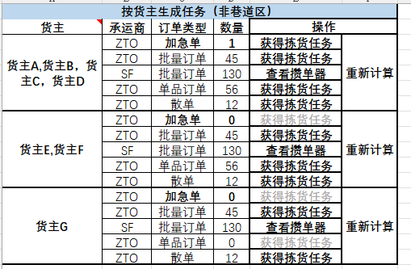
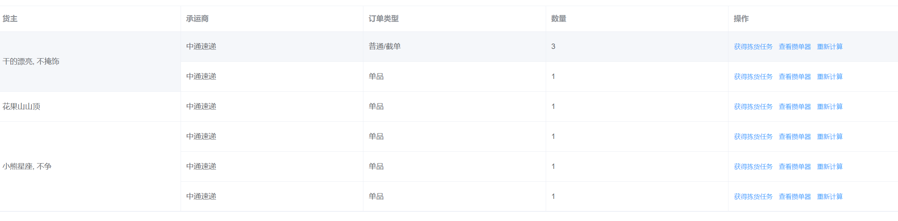

## 需求
### 数据结构
```json
{
    "code": 200,
    "data": [
        {
            "owner": "GDPL,BS_BYS",
            "type": "N",
            "typeDescribe": "普通/截单",
            "carrier": "ZTO",
            "count": 3,
            "ruleId": null,
            "key": "BSV6_TEST.N"
        },
        {
            "owner": "GDPL,BS_BYS",
            "type": "Y",
            "typeDescribe": "单品",
            "carrier": "ZTO",
            "count": 1,
            "ruleId": null,
            "key": "BSV6_TEST.Y"
        },
        {
            "owner": "HGSSD",
            "type": "Y",
            "typeDescribe": "单品",
            "carrier": "ZTO",
            "count": 1,
            "ruleId": 34,
            "key": "BSV6_TEST.Y"
        },
        {
            "owner": "XXXZ",
            "type": "Y",
            "typeDescribe": "单品",
            "carrier": "ZTO",
            "count": 1,
            "ruleId": 25,
            "key": "BSV6_TEST.Y"
        },
        {
            "owner": "BUZHENG",
            "type": "Y",
            "typeDescribe": "单品",
            "carrier": "ZTO",
            "count": 1,
            "ruleId": 25,
            "key": "BSV6_TEST.Y"
        },
        {
            "owner": "BUZHENG",
            "type": "Y",
            "typeDescribe": "单品",
            "carrier": "ZTO",
            "count": 1,
            "ruleId": 25,
            "key": "BSV6_TEST.Y"
        }
    ],
    "message": "成功"
}
```
### 需要的效果

> 1. 如果ruleId不为空则需要根据ruleId相同的合并**货主列**
> 
> 2. 如果不ruleId则需要根据owner相同的进行合并**货主列**
> 
> 3. 通过ruleId合并的队友的货主owner的值也需要合并展示

## 实现
### 关键代码
```js
objectSpanMethod({ row, column, rowIndex, columnIndex }) {
      const { finalList, owner } = this.formatRowspanAndColspan(this.tableData, 'owner', 'ruleId')
      let newRow = ''
      if (columnIndex === 0) {
        if (row.ruleId !== null) {
          owner.forEach((item) => {
            const ownersArray = Array.from(item)
            if (ownersArray.length > 0) {
              const ownerString = ownersArray.join(',')
              if (ownerString.includes(row.owner)) {
                newRow = ownerString
              }
            }
          })
          // 将拼接后的 owner 信息存储在 row 对象中
          row.ownerInfo = newRow
        }
        return {
          rowspan: finalList[rowIndex],
          colspan: 1
        }
      }
    },
    // 合并单元格辅助
    formatRowspanAndColspan(tableList, keyName, ruleId) {
      const keyNameList = []
      // 使用 Map 来存储 ruleId 和 owner 的映射关系
      const ownersMap = new Map() // 使用 Map 来存储 ruleId 和 owner 的映射关系

      tableList.forEach(t => {
        const currentRuleId = t[ruleId]
        // 如果 ruleId 不为空，优先使用 ruleId，否则使用 keyName
        if (currentRuleId !== null && currentRuleId !== undefined) {
          keyNameList.push(currentRuleId)
          if (!ownersMap.has(currentRuleId)) {
            ownersMap.set(currentRuleId, new Set()) // 初始化 ruleId 对应的 owner 集合
          }
          ownersMap.get(currentRuleId).add(t[keyName]) // 将 owner 添加到对应 ruleId 的集合中
        } else {
          keyNameList.push(t[keyName])
        }
      })

      let prev // 上一个键名的索引
      let contin = 0 // 连续相同键名个数
      const computedList = [] // 计算后的键名列表
      // 遍历键名列表，计算连续相同键名的数量
      for (let i = 0; i < keyNameList.length; i++) {
        if (computedList.length === 0) {
          computedList.push({ 'key': keyNameList[i], 'val': 1 })
        } else {
          if (keyNameList[prev] === keyNameList[i]) {
            contin++
            computedList.push({ 'key': keyNameList[i], 'val': 0 })
          } else {
            if (contin > 0) {
              const index = computedList.length - 1 - contin
              const key = computedList[index].key
              const val = computedList[index].val
              const obj = { 'key': key, 'val': val + contin }
              computedList.splice(index, 1, obj)
            }
            computedList.push({ 'key': keyNameList[i], 'val': 1 })
            contin = 0
          }
        }
        prev = i // 将 i 赋值给 prev，以便当下一次循环时获取上一个键值的索引
      }
      // 处理结尾的连续相同键名
      if (contin > 0) {
        const index = computedList.length - 1 - contin
        const key = computedList[index].key
        const val = computedList[index].val
        const obj = { 'key': key, 'val': val + contin }
        computedList.splice(index, 1, obj)
      }

      const finalList = []
      computedList.forEach(t => { finalList.push(t.val) })
      return { finalList, owner: ownersMap }
    }
```


### 完整代码
```vue
<template>
  <div class="content">
    <el-select v-model="warehouse" filterable clearable placeholder="请选择仓库"
               class="basic" @keyup.enter.native="getDateList"
    >
      <el-option v-for="item in warehousesList" :key="item.code" :label="item.name"
                 :value="item.code"
      />
    </el-select>
    <el-button type="primary" class="search-btn" @click="getDateList">查询</el-button>
    <el-table
      :data="tableData"
      :span-method="objectSpanMethod"
      border
      style="width: 100%; margin-top: 20px"
    >
      <el-table-column
        v-if="false"
        prop="ruleId"
        label="ruleId"
      />
      <el-table-column
        prop="owner"
        label="货主"
      >
        <template v-slot="scope">
          <!-- 使用拼接后的 owner 信息 -->
          {{ getOwnerNames(scope.row) }}
        </template>
      </el-table-column>
      <el-table-column
        prop="carrier"
        label="承运商"
      >
        <template v-slot="scope">
          {{ getExpressNames(scope.row) }}
        </template>
      </el-table-column>
      <el-table-column
        prop="typeDescribe"
        label="订单类型"
      />
      <el-table-column
        prop="count"
        label="数量"
      />
      <el-table-column
        label="操作"
      >
        <template slot-scope="scope">
          <el-button type="text" size="small">获得拣货任务</el-button>
          <el-button type="text" size="small">查看攒单器</el-button>
          <el-button type="text" size="small">重新计算</el-button>
        </template>
      </el-table-column>
    </el-table>
  </div>
</template>

<script>
import { getOwnerWarehouse } from '@/api/picking'
import { expressOptions, ownerOptions, warehouseOptions } from '@/api/basic'

export default {
  data() {
    return {
      tableData: [],
      ownerList: [],
      expressList: [],
      warehousesList: [],
      warehouse: 'WH01'
    }
  },
  mounted() {
    this.getDateList()
    this.getOwnerList()
    this.getExpressList()
    this.getWarehouseList()
  },
  methods: {
    // 获取拣货面板-按仓库
    async getDateList() {
      this.tableData = await getOwnerWarehouse(this.warehouse)
    },
    // 获取货主
    async getOwnerList() {
      this.ownerList = await ownerOptions()
    },
    // 获取承运商
    async getExpressList() {
      this.expressList = await expressOptions()
    },
    // 获取仓库
    async getWarehouseList() {
      this.warehousesList = await warehouseOptions()
    },
    objectSpanMethod({ row, column, rowIndex, columnIndex }) {
      const { finalList, owner } = this.formatRowspanAndColspan(this.tableData, 'owner', 'ruleId')
      let newRow = ''
      if (columnIndex === 0) {
        if (row.ruleId !== null) {
          owner.forEach((item) => {
            const ownersArray = Array.from(item)
            if (ownersArray.length > 0) {
              const ownerString = ownersArray.join(',')
              if (ownerString.includes(row.owner)) {
                newRow = ownerString
              }
            }
          })
          // 将拼接后的 owner 信息存储在 row 对象中
          row.ownerInfo = newRow
        }
        return {
          rowspan: finalList[rowIndex],
          colspan: 1
        }
      }
    },
    // 合并单元格辅助
    formatRowspanAndColspan(tableList, keyName, ruleId) {
      const keyNameList = []
      // 使用 Map 来存储 ruleId 和 owner 的映射关系
      const ownersMap = new Map() // 使用 Map 来存储 ruleId 和 owner 的映射关系

      tableList.forEach(t => {
        const currentRuleId = t[ruleId]
        // 如果 ruleId 不为空，优先使用 ruleId，否则使用 keyName
        if (currentRuleId !== null && currentRuleId !== undefined) {
          keyNameList.push(currentRuleId)
          if (!ownersMap.has(currentRuleId)) {
            ownersMap.set(currentRuleId, new Set()) // 初始化 ruleId 对应的 owner 集合
          }
          ownersMap.get(currentRuleId).add(t[keyName]) // 将 owner 添加到对应 ruleId 的集合中
        } else {
          keyNameList.push(t[keyName])
        }
      })

      let prev // 上一个键名的索引
      let contin = 0 // 连续相同键名个数
      const computedList = [] // 计算后的键名列表
      // 遍历键名列表，计算连续相同键名的数量
      for (let i = 0; i < keyNameList.length; i++) {
        if (computedList.length === 0) {
          computedList.push({ 'key': keyNameList[i], 'val': 1 })
        } else {
          if (keyNameList[prev] === keyNameList[i]) {
            contin++
            computedList.push({ 'key': keyNameList[i], 'val': 0 })
          } else {
            if (contin > 0) {
              const index = computedList.length - 1 - contin
              const key = computedList[index].key
              const val = computedList[index].val
              const obj = { 'key': key, 'val': val + contin }
              computedList.splice(index, 1, obj)
            }
            computedList.push({ 'key': keyNameList[i], 'val': 1 })
            contin = 0
          }
        }
        prev = i // 将 i 赋值给 prev，以便当下一次循环时获取上一个键值的索引
      }
      // 处理结尾的连续相同键名
      if (contin > 0) {
        const index = computedList.length - 1 - contin
        const key = computedList[index].key
        const val = computedList[index].val
        const obj = { 'key': key, 'val': val + contin }
        computedList.splice(index, 1, obj)
      }

      const finalList = []
      computedList.forEach(t => { finalList.push(t.val) })
      return { finalList, owner: ownersMap }
    },
    // 获取对应的货主商name
    getOwnerNames(row) {
      // scope.row.ruleId ? scope.row.ownerInfo : scope.row.owner
      const codes = row.ruleId ? row.ownerInfo.split(',') : row.owner.split(',')
      const ownerNames = codes.map(code => {
        const owner = this.ownerList.find(item => item.code.trim() === code.trim())
        return owner ? owner.name : ''
      })
      return ownerNames.join(', ')
    },
    // 获取对应的承运商name
    getExpressNames(row) {
      const carrier = this.expressList.find(item => item.code.trim() === row.carrier.trim())
      return carrier ? carrier.name : ''
    }
  }

}
</script>
<style lang="scss" scoped>
.search-btn {
  margin-left: 16px;
}
</style>

```

## 效果


## 完结💐💐


