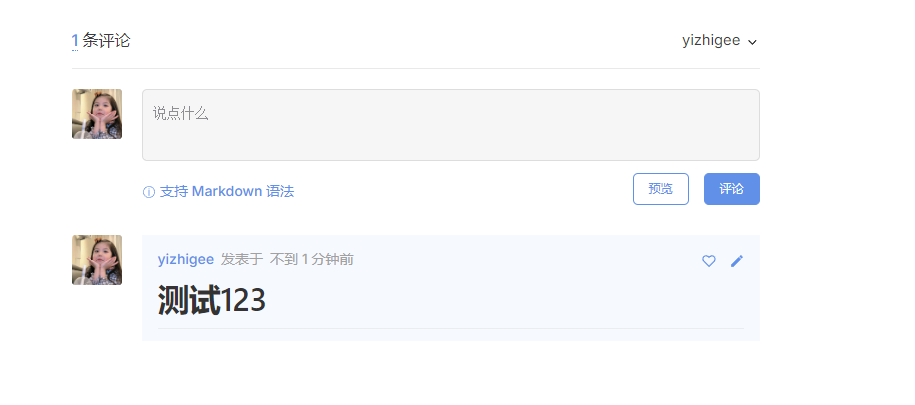

> 评论需要登陆github账户，每次评论相当于在github仓库中发issues，利用github仓库的issues来存放和管理每个用户的评论，然后gitalk调用api来显示到页面上，以达到评论和显示他人评论的目的。
## github注册OAuth应用


## 安装依赖插件
```sh
pnpm i md5 gitalk
```
## 创建评论组件
```vue
<template>
  <div class="gitalk-container">
    <div id="gitalk-container"></div>
  </div>
</template>
<script>
import md5 from "md5"
import Gitalk from "gitalk"
import "gitalk/dist/gitalk.css"
export default {
  name: "git-talk",
  data() {
    return {}
  },
  mounted() {
    const commentConfig = {
      clientID: '',// clientID
      clientSecret: '', // clientSecret
      repo: '', // 存放评论的仓库名
      owner: '', // github用户名
      admin: [''], // github管理者列表
      id: md5(location.pathname),
      distractionFreeMode: false,
    }
    const gitalk = new Gitalk(commentConfig)
    gitalk.render("gitalk-container")
  },
}
</script>
<style>
.gt-container .gt-header-textarea {
  color: #000;
}
</style>


```

## 注册全局组件
```js
// .vitepress --> theme --> index.js
import Theme from 'vitepress/theme'
import './style/var.css'
import Gitalk from '../../components/Gitalk.vue'  // 引入刚刚创建的组件
export default {
    ...Theme,
    enhanceApp(ctx) {
        Theme.enhanceApp(ctx)
        ctx.app.component("git-talk", Gitalk) // 在应用实例中注册名为 git-talk 的自定义组件 Gitalk
    },
}

```
## 在需要加入评论的页面引入组件即可
```md
<git-talk/>
```
## 效果


[my-vitepress](https://yizhigee.github.io/)


<git-talk/>
