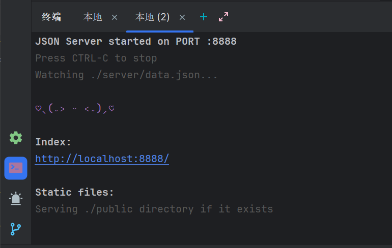

## TODO标记
>TODO: 标记代码中需要实现的功能或任务。
> 
>FIXME:标记代码中需要修复的问题或缺陷。
> 
>NOTE: 提供额外的注释或提示信息，帮助理解代码意图或设计决策。
> 
>BUG:  标记已知的Bug或错误。
> 
>XXX:  标记需要警惕或需要重点关注的代码块。
> 
>HACK: 标记临时性修复或不优雅的解决方案。

## 项目打包version自增
在build那里增加
```shell
npm version xxx
```

**npm version是node自带的一个版本控制**

例如 <span style="color:#E96D71"> version : 1.0.2</span>

| MAJOR    | 描述 |
|----------| ---- |
| MAJOR: 1 | MAJOR（主版本号）：当你做了不兼容的 API 修改时递增|
| MINOR: 0 | MINOR（次版本号）：当你添加了向下兼容的功能时递增|
| MAJOR: 2 | PATCH（补丁版本号）：当你做了向下兼容的问题修正时递增|


## 临时关闭 ESLint 规则
在文件上方加上
```jsx
/* eslint-disable react/prop-types */
```

> 不推荐 ❌️  
> 只是自己写demo的时候快速解决eslint报错问题

## 配置src别名@
```js
// vite.config.js
import { defineConfig } from 'vite'
import react from '@vitejs/plugin-react'

export default defineConfig({
  plugins: [react()],
  resolve: {
    alias: {
      '@': '/src',
    },
  },
})

```
```js
// jsconfig.json   使编辑器能够解析Vite别名配置
{
  "compilerOptions": {
    "baseUrl": ".",
    "paths": {
      "@/*": ["src/*"]
    }
  },
  "include": ["src"]
}

```

## Mock服务 json-server的使用
### 项目结构
```md
my-app/
├─ server/
│  ├─ data.json
├─ package.json

```
### 安装插件
```shell
pnpm i json-server -D
```
### 配置脚本
```json
"scripts": {
    "serve": "json-server ./server/data.json --port 8888"
  },
```
### 启动
```shell
pnpm serve
```
### 成功

> --port 8888 指定端口号 , 不需要指定可以不写
