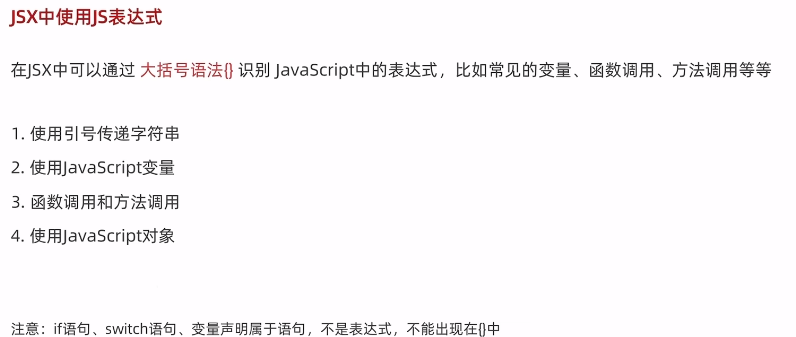
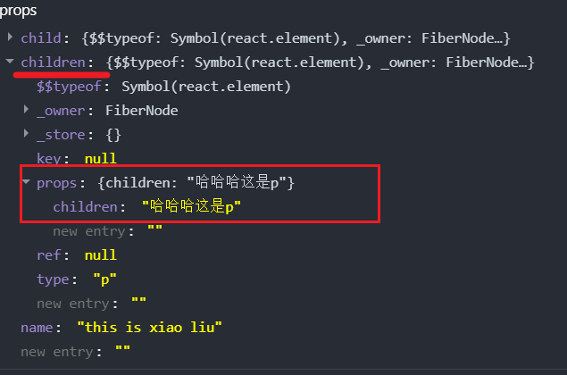
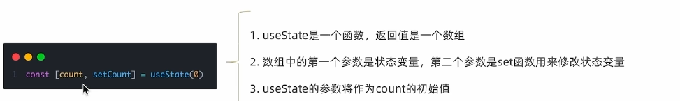
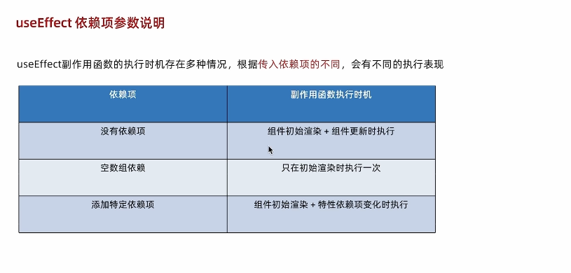
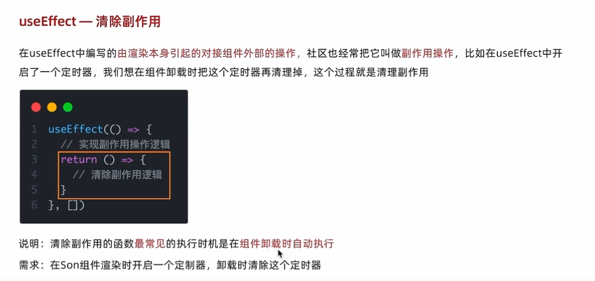
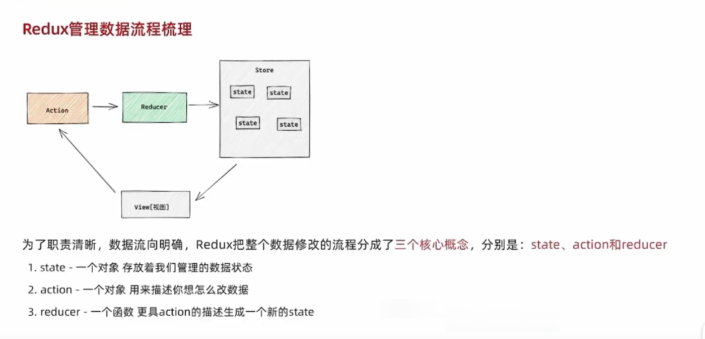

## 创建Vite项目
```sh
pnpm create vite
```
## jsx
### 优点
1. html 声明式模版写法
2. js的编程能力
### jsx本质
jsx 是js语法的扩展，浏览器本身不能识别，需要通过解析工具做解析[babel](https://www.babeljs.cn/) 解析之后才能在浏览器中运行
### jsx使用


## 渲染流程
App.js ——> main.js——> index.html(root)

## 组件间的通信
### prop
```jsx
// 父 -> App
const App = () => {
    const name = 'this is xiao liu'
    return (
        <div>
            <Communication name={name} child={<span>this is span</span>}>
                <p>哈哈哈这是p</p>
            </Communication>
        </div>
    )
}
```
```jsx
// 子 -> Communication
const Communication = (props) => {
    return (
        <div>
            {props.name}
            <br/>
            jsx:{props.child}

            {props.children}
        </div>
    );
};
```
        
> 如果把内容嵌套在了子组件的标签中，父组件会自动在名为children的prop属性中接收该内容



### 子传父
```jsx
// 子 -> Communication02
const Communication02 = ({ onGetCommunication}) => {
    const msg = 'this is communication msg'
    return (
        <div>
            <button onClick={() => onGetCommunication(msg)}>点击</button>
        </div>
    );
};
```
```jsx
// 父 -> App
const App = () => {
    const getMsg = (msg) => {
        console.log('app-msg', msg)
        setContent(msg)
    }
    const [content,setContent] = useState('')
    return (
        <div>
            {content}
            <Communication02 onGetCommunication={getMsg}/>
        </div>
    )
}
```
> 在子组件中调用父组件中的函数并传递参数

## 相关api
### useState 状态变量
> useState 状态变量
> 状态只是可读的,应该使用setCount替换它而不是修改它,直接修改不能引发视图更新


### useRef
> useRef 获取当前元素绑定的dom对象 .current 属性
### createContext 跨组件通信
> 使用 createContext 创建组件能够提供与读取的 上下文（context） <br/>
> 变量名首字母大写
> 在使用的地方用useContext获取

**使用**

```jsx
//  App->Communication03->Communication04
// 在04中使用App中的属性
export const MsgContext = createContext()
const App = () => {
    const [name,setName] = useState('')
    const getMsg = (msg) => {
        setName(msg)
    }
    return (
        <div>
            <MsgContext.Provider  value={name}>
                <Communication03 name={name}/>
            </MsgContext.Provider >
        </div>
    )
}
```
```jsx
const Communication03 = () => {
    return (
        <div>
            this is communication 03.... <br/>
            <Communication04/>
        </div>
    );
};
```
```jsx
const Communication04 = () => {
    const msg = useContext(MsgContext)
    return (
        <div>
            this is communication 04....{msg} <br/>

        </div>
    );
};
```
### useEffect
> 浏览器渲染完成之后执行，类似于vue中的mounted



### StrictMode
> 严格模式
> 
> 严格模式启用了以下仅在开发环境下有效的行为
> 
> 接口会渲染两次
> 
> 一些错误刚开始看的时候没什么问题，渲染多次则会发生问题，帮助发现错误
```jsx
// main.js
<StrictMode>
  <App />
</StrictMode>
```

### 自定义hooks
```jsx
import {useState} from 'react';

const useToggle = () => {
  const [value, setValue] = useState(true)
  const toogleClick = () => setValue(!value)
  return {value, toogleClick}
}

const CustomHooks= () => {
  const {value ,toogleClick} = useToggle();
  return (
    <div>
      {value && <div>this is div</div>}
        <button onClick={toogleClick}>toggle</button>
    </div>
  );
};

export default CustomHooks;

```
### ReactHooks使用规则
> 1.只能在组件中或者其他自定义Hook函数中调用
> 
> 2.只能在组件的顶层调用, 不能嵌套在if判断 、for循环 、其他函数中

## Redux
### redux 数据流程

### redux依赖
```sh
pnpm i @reduxjs/toolkit react-redux

```
**toolki: 简化编写redux代码方式,里面内置很多工具包**
**eact-redux: 连接react 和redux**
### redux使用
#### 项目结构
```md
pages/
├─ demo03/
│  ├─ Redux02.jsx
│  ├─ Redux01.jsx
store/
├─ index.js
├─ modules/
│  ├─ counterStore.js
main.jsx


```
#### 同步处理
```js
// store -> index.js
import {configureStore} from '@reduxjs/toolkit'
import counterStore from "./modules/counterStore.js";
// 导入子模块
const store = configureStore({
  reducer:{
    counter: counterStore
  }
})

export default store

```
```js
// 注入到入口文件 main.jsx
import React from 'react'
import ReactDOM from 'react-dom/client'
import App from './App.jsx'

import { Provider } from 'react-redux';
import store from './store'

ReactDOM.createRoot(document.getElementById('root')).render(
  <React.StrictMode>
    <Provider store={store}>
      <App />
    </Provider>
  </React.StrictMode>,
)

```
```js
// store/modules -> counterStore.js
import {createSlice}  from '@reduxjs/toolkit'

const counterStore = createSlice({
  name: 'counter',
  // 初始化state
  initialState: {
    count: 0
  },
  reducers: {
    increment(state){
      state.count ++
    },
    decrement(state){
      state.count ++
    },
    addToNum(state, action){
      state.count +=action.payload
    }
  }
})

// 解构出来action creator函数

const {increment, decrement,addToNum} = counterStore.actions;
// 获取reducer
const reducer = counterStore.reducer

// 以按需导出的方式导出action creator
export {increment,decrement ,addToNum}
// 以默认导出的方式导出reducer
export default reducer

```
```js
// pages/demo03 -> Redux01.jsx
import {useDispatch, useSelector} from "react-redux";
import {increment,decrement,addToNum} from '../../store/modules/counterStore'
const Redux01 = () => {
  const { count } = useSelector(state => state.counter)
  const dispatch = useDispatch();
  return (
    <div>
      <button onClick={()=>dispatch(decrement())}>-</button>
      {count}
      <button onClick={()=>dispatch(increment())}>+</button>
      <button onClick={()=>dispatch(addToNum(10))}>+10</button>
      <button onClick={()=>dispatch(addToNum(20))}>+20</button>
    </div>
  );
};

export default Redux01;

```
#### 异步处理

```js
// store/modules -> channelStore.js
import {createSlice} from "@reduxjs/toolkit";
import axios from "axios";

const channelStore = createSlice({
  name: 'channel',
  initialState: {
    channelList: []
  },
  reducers: {
    setChannel(state, action) {
      state.channelList = action.payload
    }
  }
});

const {setChannel} = channelStore.actions

// 封装一个函数, 在函数内部return一个新函数,在新函数中封装异步请求获取数据, 
// 调用同步action creator 传入异步数据生成一个action对象, 并使用dispatch提交
const fetchChannelList = () => {
  return async (dispatch) => {
    const result = await axios.get('http://geek.itheima.net/v1_0/channels')
    dispatch(setChannel(result.data.data.channels))
  }
}

export {fetchChannelList}
const  reducer = channelStore.reducer
export default  reducer

```
```js
// pages/demo03 -> Redux02.jsx
import {useEffect} from "react";
import {useDispatch, useSelector} from "react-redux";
import {fetchChannelList} from '../../store/modules/channelStore.js'

const Redux02 = () => {

  const {channelList} = useSelector(state => state.channel)
  const dispatch = useDispatch();

  useEffect(() => {
    dispatch(fetchChannelList())
  }, [dispatch])

  return (<div>
    <ul>
      {channelList.map(item => <li key={item.id}>{item.name}</li>)}
    </ul>
  </div>);
};

export default Redux02;

```

##  React Router
### 安装依赖
```sh
pnpm install react-router-dom
```
### 项目结构
```md
src/
├─ pages/
│  ├─ demo04/
│  │  ├─ Login.jsx
│  │  ├─ Arcitle.jsx
├─ router/
│  ├─ index.jsx
├─ main.jsx

```
### 路由使用
```jsx
// demo04 -> Article.jsx
const Article = () => {
  return (
    <div>
        this is article
    </div>
  );
};

export default Article;

```
```jsx
// demo04 -> Login.jsx
const Login = () => {
  return (
    <div>
      this is login
    </div>
  );
};

export default Login;

```
```jsx
// router -> index.jsx
import {createBrowserRouter} from "react-router-dom";
import Login from '@/pages/demo04/Login.jsx'
import Article from '@/pages/demo04/Article.jsx';

const router = createBrowserRouter([
  {
    path: '/login',
    element: <Login/>
  },
  {
    path: '/article',
    element: <Article/>
  }
])

export default router

```
```jsx
// main.jsx
import React from 'react'
import ReactDOM from 'react-dom/client'
import { Provider } from 'react-redux';
import {RouterProvider} from "react-router-dom";
import store from './store'
import router from "./router/index.jsx";

ReactDOM.createRoot(document.getElementById('root')).render(
  <React.StrictMode>
    <Provider store={store}>
      <RouterProvider router={router}></RouterProvider>
    </Provider>
  </React.StrictMode>,
)

```
### 路由导航
1. 声明式导航 Link
```jsx
import {Link} from "react-router-dom";

const Login = () => {
  return (
    <div>
      this is login
      <Link to='/article'>跳转到Article页面</Link>
    </div>
  );
};

export default Login;

```
2. 编程式导航 useNavigate
```jsx
import {useNavigate} from "react-router-dom";

const Login = () => {
  const navigate = useNavigate();
  return (
    <div>
      this is login
      <button onClick={()=> navigate('/article')}>跳转到Article页面</button>
    </div>
  );
};

export default Login;

```
### 路由传参
> useSearchParams 传参
```jsx
 // Login.jsx
  <button onClick={()=> navigate('/article?id=1001&name=yizhige')}>跳转到Article页面-params传参</button>
```

```jsx
 // article.jsx
import {useSearchParams} from "react-router-dom";

const Article = () => {
  const [params] = useSearchParams();
  const id = params.get('id')
  const name = params.get('name')
  return (
    <div>
      this is article
      <p>id: {id}</p>
      <p>name: {name}</p>
    </div>
  );
};

export default Article;

```
> useParams 传参
```jsx
 // Login.jsx
<button onClick={()=> navigate('/article/1002/yizhige')}>path传承</button>
```
```jsx
 // router -> index.jsx
{
  path: '/article/:id/:name',
  element: <Article/>
}
```
```jsx
 // Article.jsx
import {useParams} from "react-router-dom";

const Article = () => {
  const params = useParams();
  const id = params.id
  const name = params.name
  return (
    <div>
      this is article
      <p>id: {id}</p>
      <p>name: {name}</p>
    </div>
  );
};

export default Article;
```
### 嵌套路由
> 项目结构
```md
pages/
├─ About.jsx
├─ Board.jsx
├─ Layout.jsx
router/
├─ index.jsx

```
> 使用
```jsx
 // Layout.jsx
import {Link, Outlet} from "react-router-dom";

const Layout = () => {
  return (
    <div>
      this is layout <br/>
      <Link to='/board'>board</Link>
      <Link to='/about'>about</Link>
      <Outlet/>
    </div>
  );
};

export default Layout;

```
> ``` <Outlet/> ```
> 
> 在父路由元素中使用 来呈现其子路由元素如果父路由完全匹配，它将呈现子索引路由
>
> 如果没有索引路由，则不呈现任何内容。
```jsx
 // Board.jsx
const Board = () => {
  return (
    <div>
      面板页
    </div>
  );
};

export default Board;

```
```jsx
 // About.jsx
const About = () => {
  return (
    <div>
      关于页
    </div>
  );
};

export default About;

```
```jsx
 // router -> index.jsx
{
  path: '/',
    element: <Layout/>,
    children: [
  {
    // 设置为默认的二级路由, 一级路由访问的时候, 它能得到渲染
    index: true,
    element: <Board/>
  },
  {
    path:'/about',
    element: <About/>
  }
]
}
```
>  设置为默认的二级路由, 一级路由访问的时候, 它能得到渲染
> 
> 将parh改为index:true即可

### 404路由
```jsx
{
  path: '*',
  element: <NotFound/>
}
```
> 当路由表里面的路由都没有匹配到时，会匹配到404路由

### 路由模式
| hash模式 #         | history模式         |
|------------------|-------------------|
| createHashRouter | createBrowserRouter     |
## 样式变化
**class 得写成 className**
```html
<span className='foo'>this is span </span>
```

## 常用插件包

| 插件               | 插件用途                        |
|------------------|-----------------------------|
| react-redux | Redux状态管理                   |
| @reduxjs/toolkit | Redux状态管理--简化 Redux 应用开发的工具 |
| react-router-dom| 路由                          |
| classnames| class类名处理                   |
| axios| 请求插件                        |
| antd-mobile| ant design移动端组件库            |
| json-server| mock服务                      |


<p style="color: #FFD3A5">未完待续....</p>
